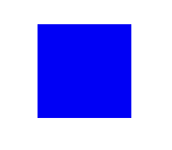

 
# Posner 实验简介

Posner 实验是一种常用于研究注意力的心理学实验，旨在探讨注意力如何影响反应时间。该实验通常包括一个固定点、一个提示和一个目标刺激。参与者的任务是根据目标的出现位置（左侧或右侧）进行反应。实验通过不同类型的提示（如方向性提示、闪光提示等）来考察其对目标识别的影响。

# 基于jsPsych的Posner 实验教程

本教程将带你一步步完成一个使用 `jsPsych` 的 Posner 实验。我们将使用 `jsPsych` 库来构建心理学实验，涉及到参与者信息收集、实验任务设计以及数据的保存。以下是具体的实现步骤和代码示例。

## 明确实验设计思路

在实验中，我们需要的刺激材料有：固定的中心注视刺激，线索提示，目标刺激。其中，目标刺激为被试所需要判断位置并进行按键反应的刺激，在本实验中为蓝色方块。

  **目标刺激**



而线索为蓝色边框。

  **提示线索**


该边框可能出现在中心注视点左侧，也可能出现在中心注视点右侧。当蓝色边框出现在中心注视点左侧时，说明目标刺激更可能出现在中心注视点左侧；当蓝色边框出现在中心注视点右侧时，说明目标刺激更可能出现在中心注视点右侧。被试需要尽可能克服蓝色边框所带来的影响，又快又准地对目标刺激出现的位置进行按键反应。

除此之外，还有一个中性线索。当它出现时，说明目标刺激出现在左侧的概率同出现在右侧的概率相同。
 
 **中性线索**


## 1. 准备工作

### 1.1 引入必要的库

首先，我们需要引入 `jsPsych` 库及相关插件，同时引入用于生成 Excel 文件的库 `xlsx`。在 HTML 文件的 `<head>` 部分添加以下内容：

```html
<!DOCTYPE html>
<html>
<head>
    <title>Posner Experiment</title>
    <!-- 引入 jsPsych 库 -->
    <script src="https://unpkg.com/jspsych@7.3.4"></script>
    <script src="https://unpkg.com/@jspsych/plugin-html-keyboard-response@1.1.3"></script>
    <script src="https://unpkg.com/@jspsych/plugin-image-keyboard-response@1.1.3"></script>
    <script src="https://unpkg.com/@jspsych/plugin-preload@1.1.3"></script>
    <!-- 引入用于生成 Excel 文件的库 -->
    <script src="https://cdnjs.cloudflare.com/ajax/libs/xlsx/0.18.5/xlsx.full.min.js"></script>
    <link href="https://unpkg.com/jspsych@7.3.4/css/jspsych.css" rel="stylesheet" type="text/css" />
</head>
<body>
    <!-- 实验目标容器 -->
    <div id="jspsych-target"></div>
</body>
</html>
```

## 2. 创建实验

### 2.1 实验目标容器样式

使用 CSS 为实验页面创建基本样式，使其居中显示并适应不同的屏幕尺寸。将以下 CSS 添加到 `<style>` 标签中：

```html
<style>
    /* 基础 Flexbox 布局样式 */
    body {
        display: flex;
        justify-content: center;
        align-items: center;
        height: 100vh;
        margin: 0;
        font-family: Arial, sans-serif;
        background-color: #f0f0f0;
    }
    /* jsPsych 目标容器的样式 */
    #jspsych-target {
        display: flex;
        flex-direction: column;
        align-items: center;
        justify-content: center;
        width: 100%;
        max-width: 800px;
        height: 100%;
        position: relative;
        padding: 20px;
        box-sizing: border-box;
        background: #fff;
        border-radius: 8px;
        box-shadow: 0 0 10px rgba(0,0,0,0.1);
    }
    /* 方块和提示框的样式 */
    .square, .cue-box {
        width: 60px;
        height: 60px;
        position: absolute;
        top: calc(50% - 30px);
    }
    .square {
        background-color: blue;
    }
    .cue-box {
        border: 5px solid blue;
    }
    .fixation {
        position: absolute;
        top: 50%;
        left: 50%;
        transform: translate(-50%, -50%);
        font-size: 60px;
        color: black;
    }
    .left {
        left: calc(50% - 200px);
    }
    .right {
        left: calc(50% + 140px);
    }
    @media (max-width: 600px) {
        .square, .cue-box {
            width: 40px;
            height: 40px;
        }
        .left, .right {
            left: 50%;
            transform: translateX(-50%);
        }
    }
    /* 参与者信息表单样式 */
    #participant-info-form {
        display: flex;
        flex-direction: column;
        gap: 10px;
        align-items: flex-start;
    }
    #participant-info-form label {
        margin-bottom: 5px;
    }
    #submit-info {
        margin-top: 10px;
        padding: 5px 10px;
        background-color: #007BFF;
        color: white;
        border: none;
        border-radius: 5px;
        cursor: pointer;
    }
    #submit-info:hover {
        background-color: #0056b3;
    }
</style>
```

### 2.2 初始化 jsPsych 

使用 initJsPsych 初始化 jsPsych 并在实验结束时调用 saveDataAsExcel 函数保存数据。

```html
<script>
    /* 将数据保存为 Excel 文件的函数 */
    function saveDataAsExcel(filename, data) {
        var ws = XLSX.utils.json_to_sheet(data);
        var wb = XLSX.utils.book_new();
        XLSX.utils.book_append_sheet(wb, ws, 'Experiment Data');
        XLSX.writeFile(wb, filename);
    }

    /* 初始化 jsPsych */
    var jsPsych = initJsPsych({
        on_finish: function() {
            var data = jsPsych.data.get().values();
            var formattedData = data.map(function(d) {
                return {
                    trial: d.trial_index,
                    task: d.task,
                    response: d.response,
                    correct: d.correct,
                    rt: d.rt,
                    accuracy: d.correct ? 1 : 0
                };
            });
            saveDataAsExcel('experiment_data.xlsx', formattedData);
        },
        display_element: 'jspsych-target'
    });
```

### 2.3 创建时间线

创建一个时间线数组 `timeline`，用于存储实验的各个步骤。

```javascript
    var timeline = [];
```
### 2.4 预加载图像 

预加载实验中需要使用的图像。

```javascript
    var preload = {
        type: jsPsychPreload,
        images: []
    };
    timeline.push(preload);
```

### 2.5 参与者信息表单

定义一个表单用于收集参与者的信息，包括参与者 ID、年龄和利手。

```javascript
    var participant_info = {
        type: jsPsychHtmlKeyboardResponse,
        stimulus: `
            <p>请输入以下信息：</p>
            <form id="participant-info-form">
                <label for="id">参与者 ID: </label><input name="id" type="text" required><br>
                <label for="age">年龄: </label><input name="age" type="number" required><br>
                <label for="hand">利手（"1" : 左利手, "2" : 右利手）: </label><input name="hand" type="text" required><br>
                <button type="button" id="submit-info">提交</button>
            </form>
            <p>按【提交】继续实验。</p>
        `,
        choices: "NO_KEYS",
        on_load: function() {
            document.getElementById('submit-info').addEventListener('click', function() {
                var form = document.getElementById('participant-info-form');
                var formData = new FormData(form);
                var responses = {};
                formData.forEach(function(value, key) {
                    responses[key] = value;
                });
                jsPsych.data.addProperties(responses);

                var experiment_timeline = [
                    /* 欢迎消息试验 */
                    {
                        type: jsPsychHtmlKeyboardResponse,
                        stimulus: "欢迎参加 Posner 实验。按任意键开始。"
                    },
                    /* 说明试验 */
                    {
                        type: jsPsychHtmlKeyboardResponse,
                        stimulus: `
                            <p>在本实验中，您需要将注意力保持在黑色的固定十字（+）上。</p>
                            <p>然后，会出现一个蓝色方块或黑色闪光图形，指示目标可能出现的位置。</p>
                            <p>如果蓝色方块轮廓出现在左侧，目标更可能出现在左侧，如果出现在右侧，目标更可能出现在右侧。</p>
                            <p>如果出现黑色闪光，目标在任一侧出现的可能性相等。</p>
                            <p><strong style="background-color: #ffff00; padding: 0 5px;">目标是一个蓝色方块。</strong></p>
                            <p>您的任务是：</p>
                            <p>在目标（蓝色方块）出现在左侧时，按【F】键。</p>
                            <p>在目标（蓝色方块）出现在右侧时，按【J】键，请尽快并尽可能准确地作答。</p>
                            <p>如果明白上述任务要求，请按任意键开始实验。</p>
                        `,
                        post_trial_gap: 2000
                    },
                    /* 固定点试验 */
                    {
                        type: jsPsychHtmlKeyboardResponse,
                        stimulus: '<div class="fixation">+</div>',
                        choices: "NO_KEYS",
                        trial_duration: 1000,
                        data: { task: 'fixation' }
                    },
                    /* 提示试验 */
                    {
                        type: jsPsychHtmlKeyboardResponse,
                        stimulus: function() {
                            var cue_type = jsPsych.timelineVariable('cue_type');
                            var fixation_html = cue_type === 'neutral_flash' ? '' : '<div class="fixation">+</div>';
                            return fixation_html + 
                                (cue_type === 'left_box' ? '<div class="cue-box left"></div>' : 
                                cue_type

 === 'right_box' ? '<div class="cue-box right"></div>' :
                                cue_type === 'neutral_flash' ? '<div style="background: black; width: 60px; height: 60px; position: absolute; top: calc(50% - 30px); left: calc(50% - 30px);"></div>' :
                                cue_type === 'neutral_arrow' ? '<div style="font-size: 60px; color: blue;">→</div>' : '');
                        },
                        choices: "NO_KEYS",
                        trial_duration: 1000,
                        data: { task: 'cue' }
                    },
                    /* 目标试验 */
                    {
                        type: jsPsychImageKeyboardResponse,
                        stimulus: '<div class="square"></div>',
                        choices: ['f', 'j'],
                        data: { task: 'target' },
                        on_finish: function(data) {
                            data.correct = (data.response === 'f' && data.cue_type === 'left_box') ||
                                (data.response === 'j' && data.cue_type === 'right_box');
                        }
                    }
                ];

                jsPsych.init({
                    timeline: experiment_timeline,
                    display_element: 'jspsych-target'
                });
            });
        }
    };
    timeline.push(participant_info);
```

### 2.6 实验任务

定义实验任务，包括固定点试验、提示试验和目标试验。

```javascript
    var trial = {
        timeline: [
            {
                type: jsPsychHtmlKeyboardResponse,
                stimulus: '<div class="fixation">+</div>',
                choices: "NO_KEYS",
                trial_duration: 1000,
                data: { task: 'fixation' }
            },
            {
                type: jsPsychHtmlKeyboardResponse,
                stimulus: function() {
                    var cue_type = jsPsych.timelineVariable('cue_type');
                    return (cue_type === 'left_box' ? '<div class="cue-box left"></div>' :
                        cue_type === 'right_box' ? '<div class="cue-box right"></div>' :
                        cue_type === 'neutral_flash' ? '<div style="background: black; width: 60px; height: 60px; position: absolute; top: calc(50% - 30px); left: calc(50% - 30px);"></div>' :
                        '<div style="font-size: 60px; color: blue;">→</div>');
                },
                choices: "NO_KEYS",
                trial_duration: 1000,
                data: { task: 'cue' }
            },
            {
                type: jsPsychImageKeyboardResponse,
                stimulus: '<div class="square"></div>',
                choices: ['f', 'j'],
                data: { task: 'target' },
                on_finish: function(data) {
                    data.correct = (data.response === 'f' && data.cue_type === 'left_box') ||
                        (data.response === 'j' && data.cue_type === 'right_box');
                }
            }
        ],
        timeline_variables: [
            { cue_type: 'left_box' },
            { cue_type: 'right_box' },
            { cue_type: 'neutral_flash' },
            { cue_type: 'neutral_arrow' }
        ],
        randomize_order: true
    };
    timeline.push(trial);
```

### 2.7 启动实验

最后，启动实验

```javascript
    jsPsych.init({
        timeline: timeline,
        display_element: 'jspsych-target'
    });
</script>
```

## 3. 运行实验

将上述代码保存为一个 `.html` 文件，然后在浏览器中打开即可开始实验。确保在运行之前已经安装了必要的库，并且 HTML 文件中引入了这些库的正确 URL。

## 4. 结果查看

实验结束后，生成的 Excel 文件 `experiment_data.xlsx` 将自动下载到你的计算机。打开这个文件，你可以查看每次实验的详细数据，包括任务、响应、正确性、反应时间等信息。

## 总结

本教程介绍了如何使用 `jsPsych` 创建一个基本的 Posner 实验，包括参与者信息收集、实验任务设计、数据保存等步骤。通过这个教程，你能够大致明白如何通过jsPsych设计一个实验，并且掌握心理学实验的基本知识。

---

**附加资源：**

- [jsPsych 官方文档](https://www.jspsych.org/)
- [XLSX.js 文档](https://github.com/SheetJS/sheetjs)
- [Posner 实验简介](https://en.wikipedia.org/wiki/Posner_cueing_task)
- [Flexbox 布局教程](https://css-tricks.com/snippets/css/a-guide-to-flexbox/)

---以下是对上述代码中涉及到 Flexbox 布局的部分的单独分析和解释。
# Flexbox 布局分析

在本实验的 HTML 文件中，使用了 Flexbox 布局来管理页面元素。下面是对 Flexbox 布局部分的详细分析。

## 1. 基础 Flexbox 布局

```css
body {
    display: flex;
    justify-content: center;
    align-items: center;
    height: 100vh;
    margin: 0;
    font-family: Arial, sans-serif;
    background-color: #f0f0f0;
}
```

- `display: flex;`：将 `<body>` 元素设置为 Flex 容器，使其子元素能够利用 Flexbox 布局规则进行排列。
- `justify-content: center;`：在主轴（水平方向）上居中对齐子元素。
- `align-items: center;`：在交叉轴（垂直方向）上居中对齐子元素。
- `height: 100vh;`：设置 `<body>` 元素的高度为视口的 100%，使其充满整个浏览器窗口的高度。
- `margin: 0;`：移除默认的边距，使 `<body>` 元素充满整个视口。
- `font-family: Arial, sans-serif;` 和 `background-color: #f0f0f0;`：设置字体和背景颜色。

## 2. jsPsych 目标容器样式

```css
#jspsych-target {
    display: flex;
    flex-direction: column;
    align-items: center;
    justify-content: center;
    width: 100%;
    max-width: 800px; /* 最大宽度限制 */
    height: 100%;
    position: relative;
    padding: 20px;
    box-sizing: border-box;
    background: #fff; /* 白色背景 */
    border-radius: 8px; /* 圆角边框 */
    box-shadow: 0 0 10px rgba(0,0,0,0.1); /* 阴影效果 */
}
```

- `display: flex;`：将 `<div id="jspsych-target">` 设置为 Flex 容器，使其子元素按 Flexbox 规则排列。
- `flex-direction: column;`：使子元素在主轴上垂直排列。
- `align-items: center;`：在交叉轴（水平方向）上居中对齐子元素。
- `justify-content: center;`：在主轴（垂直方向）上居中对齐子元素。
- `width: 100%;` 和 `max-width: 800px;`：设置容器的宽度为 100%，并限制最大宽度为 800px，以确保在大屏幕上的适当显示。
- `height: 100%;`：使容器高度填满父元素的高度。
- `position: relative;`：为定位子元素提供参考。
- `padding: 20px;`：为容器添加内边距。
- `box-sizing: border-box;`：包括内边距和边框在内的总宽度和高度计算。
- `background: #fff;`、`border-radius: 8px;` 和 `box-shadow: 0 0 10px rgba(0,0,0,0.1);`：设置容器的背景颜色、圆角和阴影效果。

## 3. 方块和提示框的样式

```css
.square, .cue-box {
    width: 60px; /* 统一大小 */
    height: 60px; /* 统一大小 */
    position: absolute;
    top: calc(50% - 30px); /* 垂直居中 */
}
```

- `width: 60px;` 和 `height: 60px;`：设置 `.square` 和 `.cue-box` 元素的宽度和高度。
- `position: absolute;`：将这些元素从文档流中移除，允许精确定位。
- `top: calc(50% - 30px);`：在容器中垂直居中这些元素，通过计算将其中心对齐。

## 4. 响应式设计调整

```css
@media (max-width: 600px) {
    .square, .cue-box {
        width: 40px; /* 小屏幕下的尺寸调整 */
        height: 40px; /* 小屏幕下的尺寸调整 */
    }
    .left, .right {
        left: 50%; /* 小屏幕下居中对齐 */
        transform: translateX(-50%); /* 小屏幕下居中对齐 */
    }
}
```

- `@media (max-width: 600px) { ... }`：为屏幕宽度小于 600px 的设备定义响应式样式。
- `.square, .cue-box`：调整方块和提示框的尺寸，以适应较小的屏幕。
- `.left, .right`：在小屏幕下调整这些元素的位置，使其居中对齐。

## 5. 参与者信息表单样式

```css
#participant-info-form {
    display: flex;
    flex-direction: column;
    gap: 10px;
    align-items: flex-start;
}
#participant-info-form label {
    margin-bottom: 5px;
}
#submit-info {
    margin-top: 10px;
    padding: 5px 10px;
    background-color: #007BFF;
    color: white;
    border: none;
    border-radius: 5px;
    cursor: pointer;
}
#submit-info:hover {
    background-color: #0056b3;
}
```

- `#participant-info-form`：
  - `display: flex;` 和 `flex-direction: column;`：将表单的子元素垂直排列。
  - `gap: 10px;`：在子元素之间添加间距。
  - `align-items: flex-start;`：将子元素对齐到表单的开始边缘（左侧）。

- `#submit-info`：
  - `margin-top: 10px;`：在按钮上方添加外边距。
  - `padding: 5px 10px;`：设置按钮的内边距。
  - `background-color: #007BFF;` 和 `color: white;`：设置按钮的背景颜色和文本颜色。
  - `border: none;` 和 `border-radius: 5px;`：移除按钮的边框并添加圆角。
  - `cursor: pointer;`：在按钮上悬停时显示手形光标。

- `#submit-info:hover`：
  - `background-color: #0056b3;`：在按钮上悬停时改变背景颜色，以提供视觉反馈。

---

这些 Flexbox 布局的应用确保了实验界面的响应式设计，使其在不同屏幕尺寸上都能保持良好的视觉效果和用户体验，而不会受到屏幕大小的影响和限制，从而导致排版混乱和不清晰等情况。